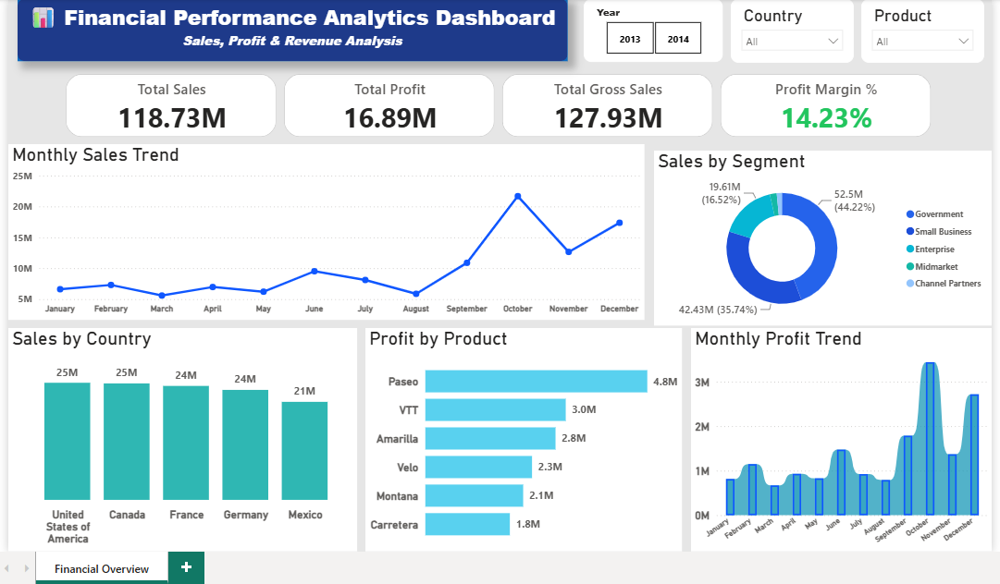

# Financial Analytics Dashboard

## Project Overview

Developed an interactive Financial Analytics Dashboard using Power BI to analyze sales, profit, gross sales, profit margin, and overall business performance. The dashboard provides interactive insights through KPIs, DAX Measures, slicers, and visualizations to support data-driven decision-making.

---

## Dashboard Preview

---

## Tools & Skills

- Microsoft Power BI
- DAX
- Power Query
- Financial Analysis
- Financial Reporting
- KPI Reporting
- Data Analysis
- Data Visualization
- Dashboard Development

---

## Key Metrics

- Total Sales: **118.73M**
- Total Profit: **16.89M**
- Gross Sales: **127.93M**
- Profit Margin: **14.23%**
- Countries Analyzed: **5**
- Business Segments: **4**

---

## Key Insights

- Analyzed financial performance across **5 countries** and **4 business segments**.
- Monitored monthly sales trends and profit performance through interactive dashboards.
- Compared product-wise profitability to identify top-performing products.
- Evaluated country-wise sales performance and business segment contribution.
- Achieved business performance analysis through a **14.23% profit margin**.
- Enabled quick business insights using KPIs, DAX Measures, slicers, and interactive visualizations.

---

## Files Included

- Financial Performance Analytics Dashboard.pbix
- financial-performance-analytics-dashboard.png
- Financial Performance Analytics Dashboard.pdf

---

## Purpose

This project was created to strengthen financial data analysis, dashboard development, and business reporting skills using Power BI while building a practical analytics portfolio.
